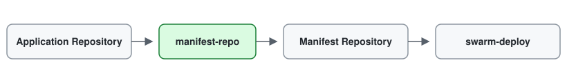

# manifest-repo

`manifest-repo` publishes application deployment manifests into a central Git repository that acts as the desired state for GitOps.

The primary interface is the **GitHub Action**. Application repositories build and release their own images, then use `manifest-repo` to update the corresponding manifest in a shared deployment repository. A GitOps controller such as [swarm-deploy](https://github.com/swarm-deploy/swarm-deploy) reconciles the runtime from that repository.

## Why manifest-repo?

In a multi-application setup, each application repository usually knows how to build and release its own artifact. It should not also need to know how to access the deployment target or reconcile the whole environment.

A central manifest repository separates those responsibilities:

- application repositories own source code, image builds, and releases;
- the manifest repository owns the desired deployment state;
- the GitOps controller watches the manifest repository and applies that state.

This gives the deployment state its own Git history, keeps application CI decoupled from the runtime, and provides one place to see which versions are supposed to be deployed across the environment.

## Central repository approach



Application repositories own builds and releases. `manifest-repo` publishes the resulting deployment manifest to the central manifest repository, and the GitOps controller consumes that repository as the desired state.

Each application repository publishes only the manifest it owns. The central repository combines those manifests into the desired state consumed by the GitOps controller.

A central repository might look like this:

```text
applications/
├── api.yaml
├── frontend.yaml
└── worker.yaml
```

A release of `api`, for example, updates `applications/api.yaml`. The application workflow does not deploy directly to Docker Swarm; it only changes Git. The GitOps controller detects that change and performs reconciliation.

## GitHub Action

Use the Action from an application release workflow:

```yaml
name: Publish manifest

on:
  release:
    types: [published]

jobs:
  publish-manifest:
    runs-on: ubuntu-latest
    steps:
      - name: Checkout
        uses: actions/checkout@v7

      - name: Publish deployment manifest
        uses: swarm-deploy/manifest-repo@v0.1.0
        with:
          source: deploy/prod.yaml
          repo: example/manifests
          branch: main
          stack: api
          registry: ghcr.io/example
          tag: ${{ github.event.release.tag_name }}
          mode: merge
          message: "chore(gitops): sync api from ${{ github.repository }}@${{ github.sha }}"
          token: ${{ secrets.MANIFEST_REPO_TOKEN }}
```

The token must have permission to push to the target repository.

### What the Action does

For a publish operation, `manifest-repo`:

1. renders the application Compose manifest for the release;
2. rewrites service images to the configured registry and tag;
3. records the source repository in deployment labels;
4. clones the central manifest repository;
5. merges or replaces the target manifest;
6. validates the resulting Compose file;
7. commits and pushes the change.

The Action does **not** build container images and does not deploy directly to Docker Swarm. Image building remains part of the application workflow; reconciliation remains the responsibility of the GitOps controller.

### Main inputs

| Input | Required | Description |
| --- | --- | --- |
| `source` | no | Source Compose file. Defaults to `deploy/prod.yaml`. |
| `repo` | yes | Central manifest repository as `owner/name` or a Git URL. |
| `branch` | no | Target branch. Defaults to `main`. |
| `stack` | yes | Application/stack name. Also determines the default target path. |
| `registry` | yes | Container registry used when rendering service images. |
| `tag` | yes | Release tag used when rendering service images. |
| `token` | yes | Git token with write access to the target repository. |
| `message` | yes | Commit message for the manifest update. |
| `target` | no | Explicit repository-relative target path. |
| `mode` | no | `merge` or `replace`. Defaults to `merge`. |
| `validate-compose` | no | Validate the resulting file with `docker compose config`. Defaults to `true`. |

With `stack: api`, the default target is `applications/api.yaml`. Use `target` when the central repository uses a different layout.

See [action.yml](./action.yml) for the complete input reference.

## Merge behavior

In `merge` mode, entries from the published manifest replace or add entries in these Compose sections while preserving unrelated entries already present in the target:

- `services`
- `networks`
- `volumes`
- `secrets`
- `configs`

Entries are replaced as complete objects; service definitions are not deep-merged.

Use `mode: replace` when the application should own the complete target file.

## CLI

The GitHub Action is backed by the `manifest-repo` Go CLI. The CLI is useful for local testing, custom CI systems, and lower-level automation.

See [CLI reference](./docs/cli.md) for the `render`, `merge`, and `publish` commands.

## Development

```bash
go test ./...
go build ./cmd/manifest-repo
docker build -t manifest-repo-action:test .
docker run --rm manifest-repo-action:test help
```
